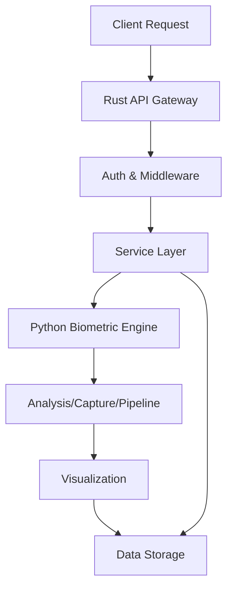

# Secure Biometric Analysis System - Project State

Last Updated: 2024-12-30 15:53:33 -03:00

## System Architecture Overview

### 1. Core Components

#### Rust Backend (`rust-process/`)
- **Entry Point**: `src/main.rs`
- **Version**: 0.2.0
- **Server Configuration**:
  - Binding: 127.0.0.1:8080
- **Core Dependencies** (from Cargo.toml):
  - ring (cryptography)
  - sled (embedded database)
  - bincode (serialization)
  - zstd (compression)
  - tokio 1.35 (async runtime)
- **Actual Module Structure**:
  ```
  src/
  ├── api/
  ├── config/
  ├── error.rs
  ├── main.rs
  ├── middleware/
  ├── models.rs
  ├── rag/
  ├── repositories/
  ├── services/
  ├── storage/      # Template vault implementation
  ├── templates/    # Template data structures
  ├── security/     # Encryption and key management
  └── metrics/      # Logging and performance tracking
  ```

#### Python Biometric Engine (`src/`)
- **Entry Point**: `src/main.py`
- **Actual Module Structure**:
  ```
  biometric/
  ├── analysis/
  ├── auth/
  ├── capture/
  ├── pipeline.py
  ├── utils/
  └── visualization/
  ```

### 2. Data Flow



### 3. Security Implementation

#### Authentication
- Located in `biometric/auth/` and Rust middleware
- JWT implementation present in Rust service

#### API Security
- Error handling via `error.rs`
- Middleware components present
- API routes in dedicated directory

#### Additional Security Features
- ChaCha20-Poly1305 encryption for template data
- Secure key management with rotation support
- Nonce generation for encryption operations
- Transparent template vault encryption
- Comprehensive security testing suite
- Batch re-encryption capabilities
- High-throughput database configuration

### 4. Development Environment

#### Dependencies
- Rust: Managed via Cargo (see Cargo.toml)
- Python: requirements.txt present
- Documentation: README.md and docs/ directory

#### Configuration
- Environment files present:
  - .env
  - .env.example
  - .env.test

### 5. Current Project Structure

```
secure-biometric/
├── rust-process/
│   ├── src/           [Verified structure above]
│   ├── migrations/    [Present]
│   ├── tests/        [Present]
│   ├── Cargo.toml    [Verified]
│   └── Cargo.lock    [Present]
├── src/
│   ├── biometric/    [Verified structure above]
│   └── main.py       [Verified]
├── docs/             [Present]
├── exploration/      [Present]
└── requirements.txt  [Present]
```

## Verified Components Status

### Rust Service
- ✅ HTTP server implementation in main.rs
- ✅ Error handling (error.rs)
- ✅ Model definitions (models.rs)
- ✅ API routing structure
- ✅ Repository layer
- ✅ Service layer
- ✅ Configuration management
- ✅ RAG implementation structure
- ✅ Template vault implementation
- ✅ Encryption engine with ChaCha20-Poly1305
- ✅ Key rotation mechanism
- ✅ High-performance storage with sled
- ✅ Comprehensive test infrastructure
- ✅ Logging and metrics system
- ✅ Batched operations support

### Python Engine
- ✅ Analysis module
- ✅ Authentication module
- ✅ Capture module
- ✅ Pipeline implementation
- ✅ Utility functions
- ✅ Visualization capabilities

## Development Notes

### Documentation Status
- Main README.md present (13,401 bytes)
- License present (MIT, 11,324 bytes)
- Additional documentation in docs/ directory
- Detailed Rust backend design (`docs/RUST_BACKEND_DESIGN.md`)
- Python process documentation (`docs/PYTHON_PROCESS.md`)
- Testing documentation (`docs/RUST_TESTING.md`)

### Current Development State
- Project appears to be in active development
- Test environment configured
- Example configurations provided
- Migration system in place

## Next Steps & TODOs
1. Monitor performance metrics in production
2. Evaluate encryption performance
3. Review database maintenance routines
4. Optimize concurrent operations
5. Enhance error reporting
6. Expand security test coverage
7. Review test coverage in both Python and Rust components
8. Analyze the interaction between Rust and Python components
9. Verify database schema and migrations
10. Document API endpoints
11. Review security measures implementation
12. Assess logging and monitoring setup

---
Note: This document reflects the latest changes as of 2024-12-30 15:53:33 -03:00.
