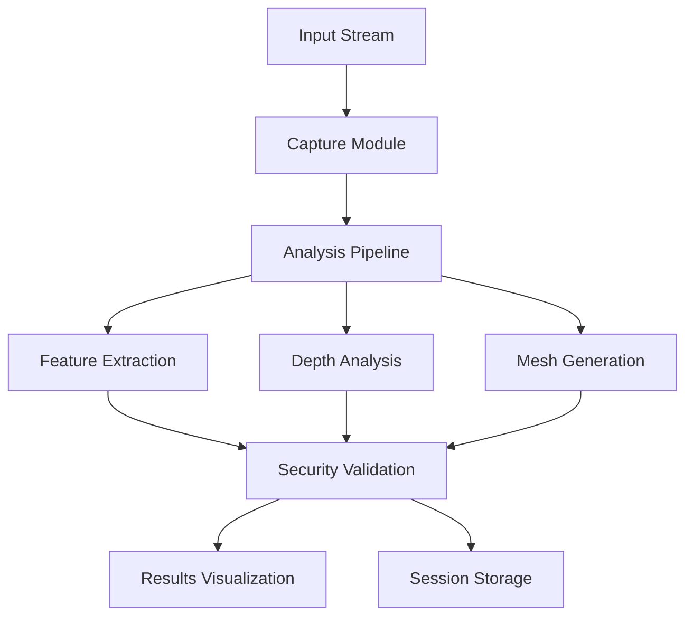

# Secure Biometric Analysis System

A robust biometric analysis system for capturing, processing, and analyzing facial biometric data with a focus on security and accuracy.

## Overview

This project implements a comprehensive biometric analysis pipeline that processes facial data using advanced computer vision techniques. It includes features for real-time capture, depth analysis, mesh generation, and security validation.

## Architecture



## Key Features

- Real-time biometric data capture
- Advanced facial feature extraction
- 3D depth analysis and mesh generation
- Security validation and anti-spoofing
- Session management and result visualization
- Interactive analysis dashboard

## Technical Stack

- **Computer Vision**: OpenCV, MediaPipe
- **3D Processing**: Open3D
- **Data Processing**: NumPy, Pandas, SciPy
- **Visualization**: Matplotlib, Plotly

## Project Structure

```
secure-biometric/
├── src/
│   ├── biometric/
│   │   ├── analysis/      # Core analysis components
│   │   ├── auth/          # Authentication and security
│   │   ├── capture/       # Data capture modules
│   │   ├── utils/         # Utility functions
│   │   └── visualization/ # Result visualization
│   ├── config/            # Configuration files
│   └── main.py           # Application entry point
├── documentation/         # Project documentation
└── requirements.txt      # Dependencies
```

## Installation

1. Clone the repository:
```bash
git clone https://github.com/yourusername/secure-biometric.git
cd secure-biometric
```

2. Install dependencies:
```bash
pip install -r requirements.txt
```

## Usage

Run the main application:
```bash
python src/main.py
```

The interactive menu provides options for:
- Starting new analysis sessions
- Listing existing sessions
- Viewing session results
- Managing session data

## Requirements

- Python 3.8+
- See `requirements.txt` for complete list of dependencies

## License

This project is licensed under the terms specified in the LICENSE file.

## Contributing

Contributions are welcome! Please read our contributing guidelines and submit pull requests for any enhancements.
