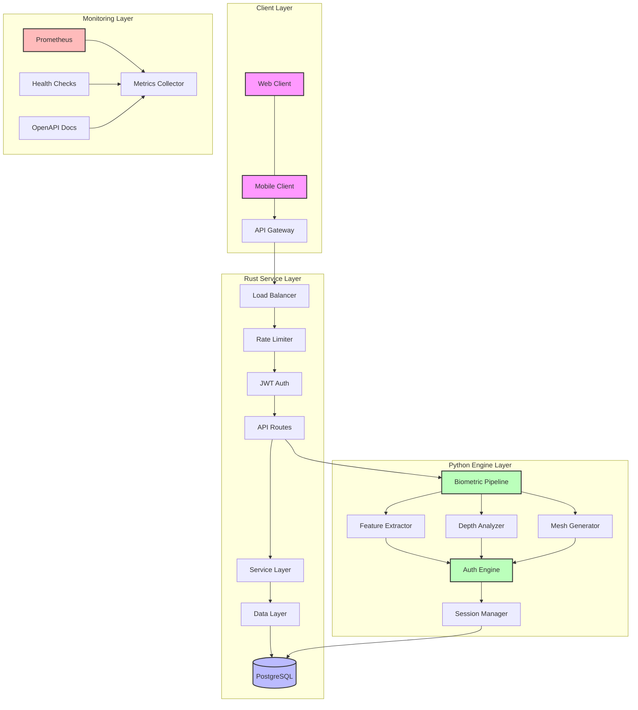
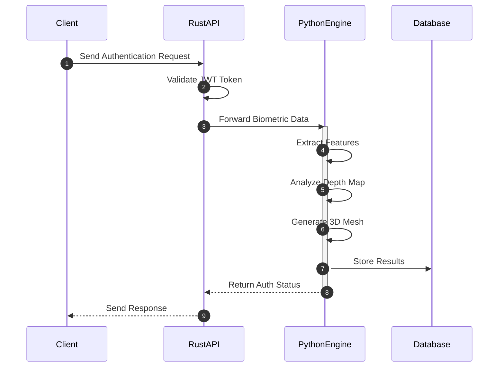
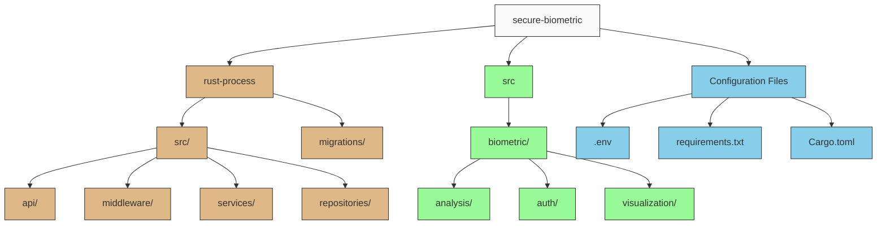
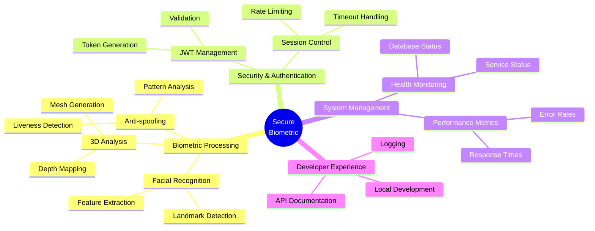
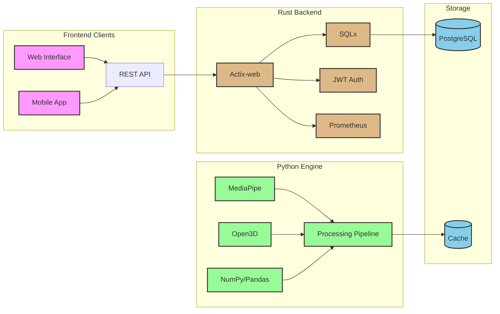
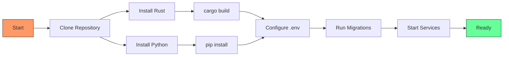
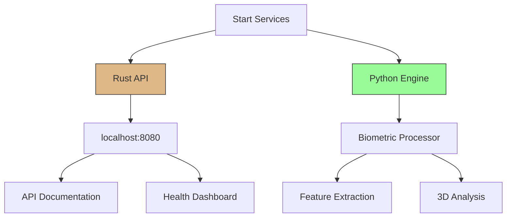
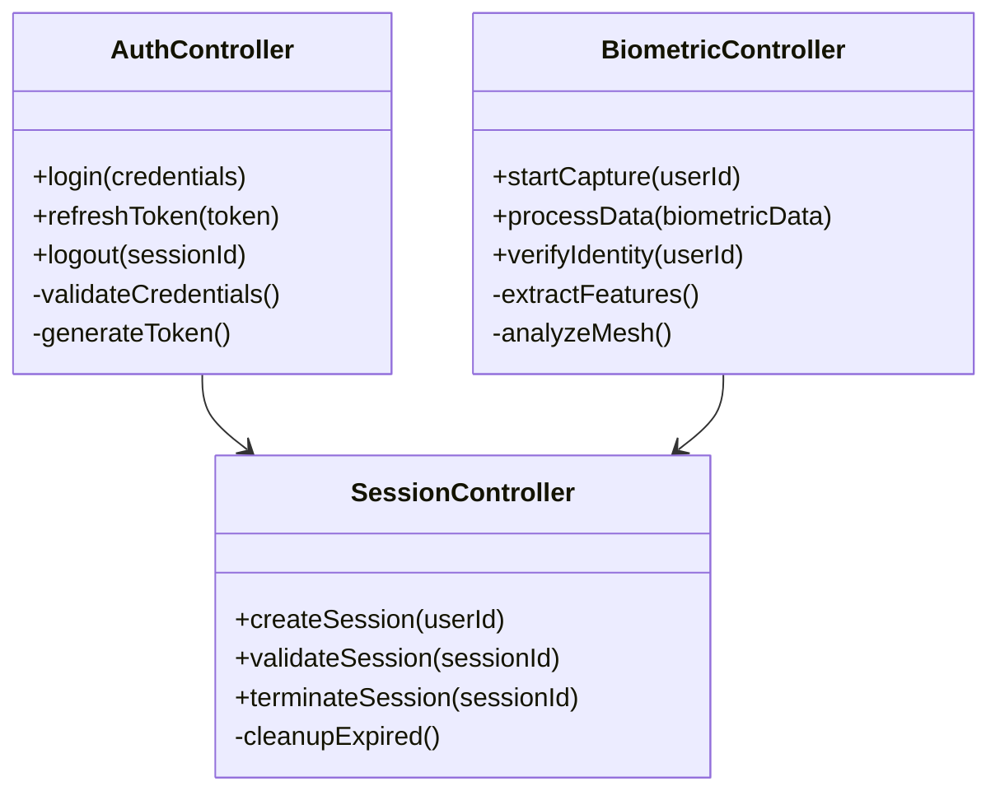
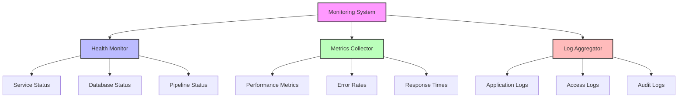

# Secure Biometric Analysis System

A robust biometric authentication and analysis system combining a high-performance Rust web service with advanced Python-based biometric processing capabilities. This system provides secure, scalable, and reliable biometric authentication for enterprise applications.

> 🔒 **Security First**: Built with security best practices at its core, featuring end-to-end encryption, secure session management, and comprehensive audit logging.

## Overview

The Secure Biometric system consists of two main components:
- A high-performance Rust web service handling API requests, authentication, and data management
- A sophisticated Python engine for biometric processing, featuring real-time facial analysis and 3D mesh generation

**Key Benefits:**
- Fast and reliable biometric authentication
- Scalable architecture supporting high concurrent loads
- Comprehensive security measures and audit trails
- Real-time processing with advanced anti-spoofing

## System Architecture

Our architecture follows a layered approach, separating concerns for better maintainability and scalability:

> 💡 **Note**: The system is designed to be horizontally scalable, with each component capable of running in distributed mode.

## Component Interaction

The following diagram illustrates how different components interact during a typical authentication flow:

> ⚡ **Performance**: Asynchronous processing ensures optimal response times even under heavy load.

## Project Structure

The codebase is organized into two main components, each with its specialized focus:

**Directory Overview:**
- `rust-process/`: Contains the Rust web service (API, auth, data management)
- `src/`: Houses the Python biometric engine (feature extraction, analysis)
- Configuration files in the root directory

## Key Features

> 🌟 **Core Capabilities**

### 1. Biometric Processing
- Real-time facial recognition with sub-second response time
- Advanced 3D depth analysis for enhanced security
- Anti-spoofing measures to prevent fraudulent attempts

### 2. Security & Authentication
- JWT-based secure authentication
- Rate limiting and brute force protection
- Complete audit trail of all authentication attempts

### 3. System Management
- Comprehensive health monitoring
- Performance metrics and alerting
- Detailed logging and diagnostics

### 4. Developer Experience
- Clear API documentation
- Comprehensive logging
- Easy local development setup

## Technical Stack

Our carefully selected technology stack ensures reliability, performance, and maintainability:

> 🛠️ **Tech Choices**: Each technology was chosen for its specific strengths in handling biometric processing and secure authentication.

## Quick Start

Getting started with development is straightforward:

### 1. Installation Steps

**Prerequisites:**
- Rust 1.70 or higher
- Python 3.9 or higher
- PostgreSQL 13 or higher

**Quick Setup:**
1. Clone the repository
2. Install dependencies
3. Configure environment
4. Run migrations
5. Start services

### 2. Run Services

> 🚀 **Development Mode**: Use `cargo watch` for automatic reloading during development.

## API Documentation

Our API is fully documented and follows REST best practices:

> 📚 **Interactive Docs**: Access complete API documentation at `http://localhost:8080/api/docs`

## Monitoring

Comprehensive monitoring ensures system health and performance:

**Key Metrics:**
- Response times
- Error rates
- Authentication success/failure
- System resource usage

> 📊 **Dashboards**: Access monitoring dashboards at `http://localhost:8080/metrics`

## Security Considerations

> 🔐 **Important Security Notes**

1. **Authentication**
   - Always use HTTPS in production
   - Regularly rotate JWT secrets
   - Enable rate limiting

2. **Data Protection**
   - Biometric data is encrypted at rest
   - Secure transmission with TLS
   - Regular security audits

3. **Compliance**
   - GDPR-compliant data handling
   - Configurable data retention
   - Audit logging for all operations

## Best Practices

1. **Development**
   - Follow the coding style guide
   - Write tests for new features
   - Document API changes

2. **Deployment**
   - Use environment variables for configuration
   - Enable all security features
   - Set up monitoring and alerting

3. **Maintenance**
   - Regular dependency updates
   - Security patch management
   - Performance monitoring

## Contributing

We welcome contributions! Please follow these steps:

1. Fork the repository
2. Create a feature branch
3. Submit a pull request

> 📝 **Guidelines**: Read [Contributing Guidelines](CONTRIBUTING.md) before submitting PRs.

## License & Support

- Licensed under MIT - see [LICENSE](LICENSE)
- For support, open an issue or contact the maintainers
- Commercial support available

---

> 🔍 **Need Help?** Project is under development, you can email me at [Email](jtperez.acle@gmail.com) or hit me up on [LinkedIn](https://www.linkedin.com/in/jose-tomas-perez-acle-833a761b9/).
