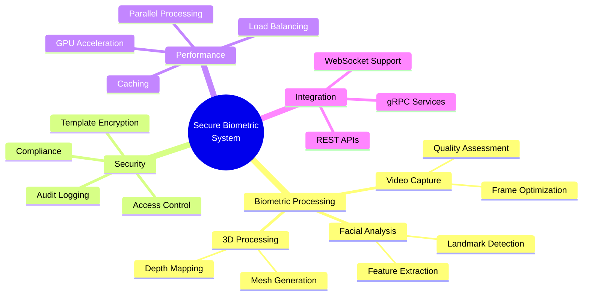
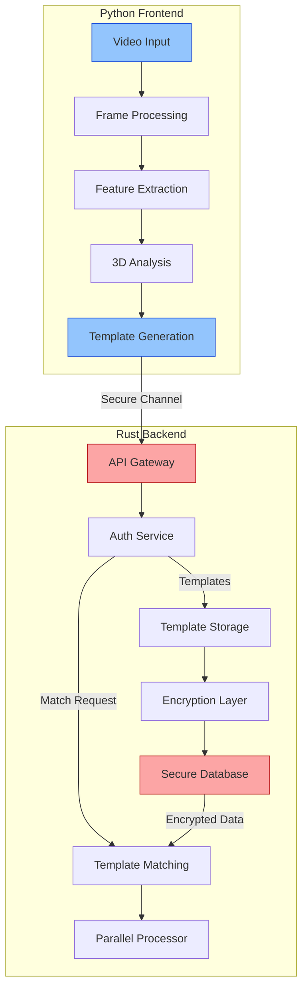
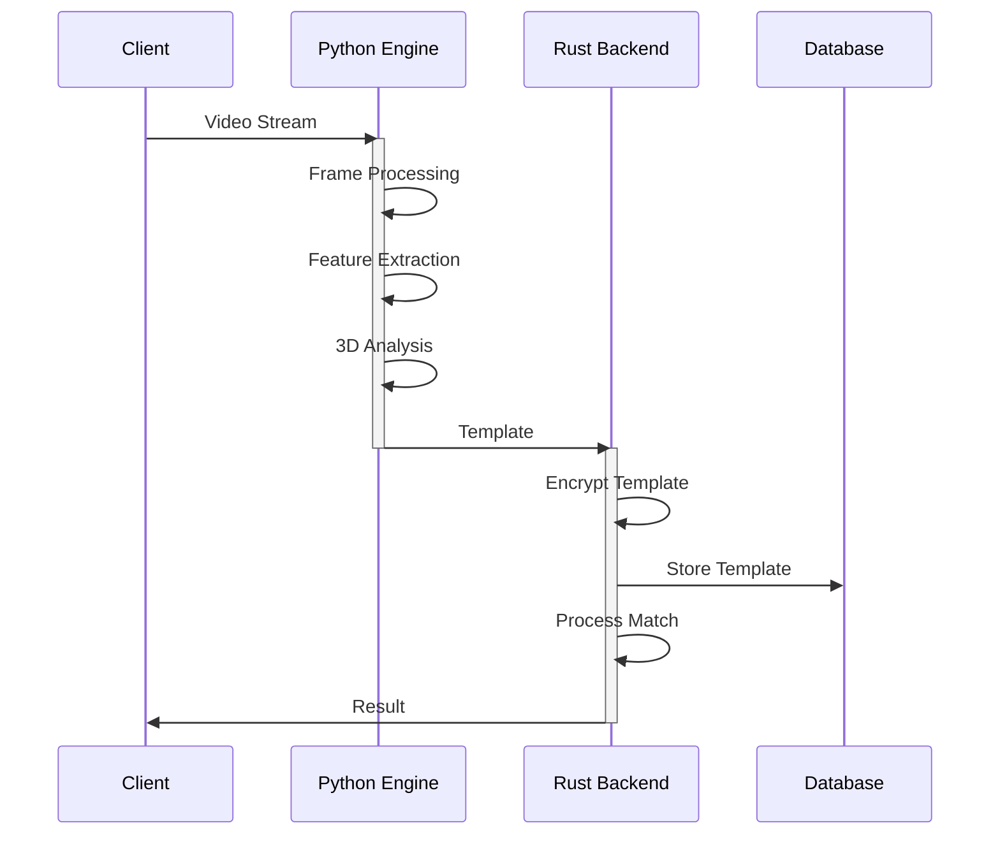
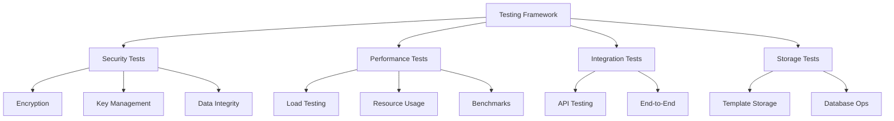
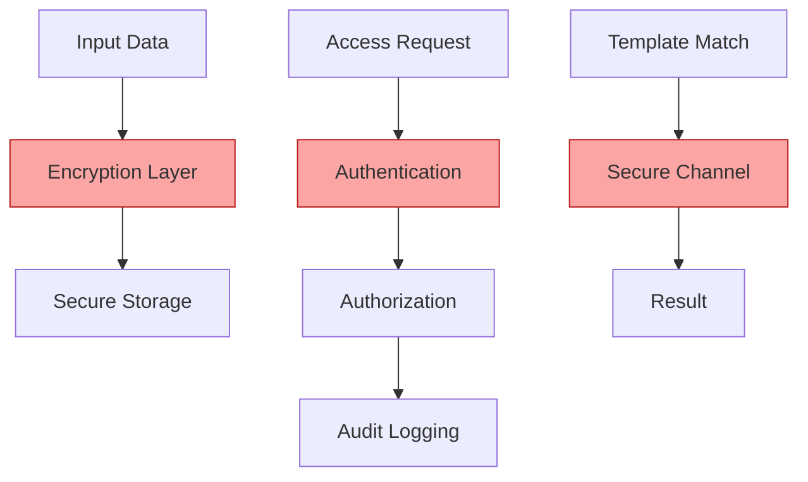

# Secure Biometric Analysis System

<div align="center">

[]()
[](LICENSE)
[](https://www.python.org/downloads/)
[](https://www.rust-lang.org/)

*A state-of-the-art biometric analysis system combining Python's computer vision capabilities with Rust's secure processing engine*

[Getting Started](#getting-started) •
[Documentation](#documentation) •
[Features](#key-features) •
[Architecture](#system-architecture) •
[Contributing](#contributing)

</div>

---

## 🎯 Project Overview

The Secure Biometric Analysis System is designed to provide enterprise-grade biometric processing with a focus on security, performance, and accuracy. By combining Python's rich computer vision ecosystem with Rust's systems programming capabilities, we deliver a robust solution for biometric analysis and secure template management.

### 🔑 Key Features



## 🏗 System Architecture

Our system follows a dual-language architecture that maximizes the strengths of both Python and Rust:



### Processing Pipeline



## 🧪 Testing Framework

Our testing infrastructure ensures reliability, security, and performance across all components:



### 🎯 Test Coverage

The Rust backend features comprehensive test coverage across critical components:

- **Security Testing**
  - Encryption/decryption operations
  - Key rotation mechanisms
  - Nonce uniqueness verification
  - Tampering detection
  - Data integrity validation

- **Performance Testing**
  - Template retrieval: ~215μs per template
  - Database writes: 3,500+ ops/sec
  - Batch storage: ~300μs per template
  - Memory usage monitoring
  - Concurrent operation handling

- **Integration Testing**
  - API endpoint validation
  - Error handling scenarios
  - Component interaction verification
  - End-to-end flow testing

For detailed testing documentation, see [Rust Testing Documentation](docs/RUST_TESTING.md).

## 🛠 Components

### Python Processing Engine
- Real-time video capture and optimization
- 68-point facial landmark detection
- Advanced feature analysis
- 3D depth mapping and mesh generation
- Expression analysis
- Visualization tools

### Rust Security Backend
- Encrypted template storage
- High-performance template matching
- Parallel processing capabilities
- Compliance management
- Audit logging
- Access control

## 🔒 Security Features



- AES-256 encryption for templates
- Secure key management
- Access control and authentication
- Comprehensive audit logging
- GDPR and CCPA compliance

## ⚡ Performance Optimizations

- Parallel processing with Rayon
- GPU acceleration for computations
- Memory-optimized data structures
- Strategic caching
- Load balancing for high availability

## 📚 Documentation

- [Python Process Documentation](docs/PYTHON_PROCESS.md)
- [Rust Backend Design](docs/RUST_BACKEND_DESIGN.md)
- [Project State](PROJECT_STATE.md)
- [Changelog](CHANGELOG.md)

## 📦 Requirements

### Python Dependencies
```python
opencv-python>=4.8.0
dlib>=19.24.0
numpy>=1.24.0
pytorch>=2.0.0
open3d>=0.17.0
```

### Rust Dependencies
```toml
[dependencies]
tokio = { version = "1.35", features = ["full"] }
actix-web = "4.4"
sled = "0.34"
ring = "0.17"
uuid = { version = "1.6", features = ["v4", "serde"] }
serde = { version = "1.0", features = ["derive"] }
serde_json = "1.0"
thiserror = "1.0"
rayon = "1.7"
prometheus = "0.13"
```

## 🚀 Latest Features (v0.2.0)

### Security
- ChaCha20-Poly1305 encryption for improved performance
- Enhanced key rotation with proper concurrency handling
- Secure template storage with encryption at rest
- Comprehensive security test suite

### Performance
- Template retrieval: ~215μs per template
- Database writes: 3,500+ ops/sec
- Batch storage: ~300μs per template
- High-throughput database configuration
- Optimized concurrent operations

### Testing
- Comprehensive test framework
- Security-focused test suite
- Performance benchmarking
- Integration testing
- Detailed test documentation

For a complete list of changes, see our [Changelog](CHANGELOG.md).

## 🚀 Getting Started

*Coming Soon*

The project is currently in active development. Setup and usage instructions will be provided as components are implemented.

## 🤝 Contributing

We welcome contributions! Please read our contributing guidelines (coming soon) before submitting pull requests.

## 📄 License

This project is licensed - see the [LICENSE](LICENSE) file for details.

## 🙏 Acknowledgments

- OpenCV community
- dlib developers
- Rust community
- Security researchers

---

<div align="center">

📝 **Project Status**: Under Development  
🔄 **Last Updated**: 2024-12-30 14:26:59 UTC-03:00  
📋 **Version**: 0.2.0

</div>
