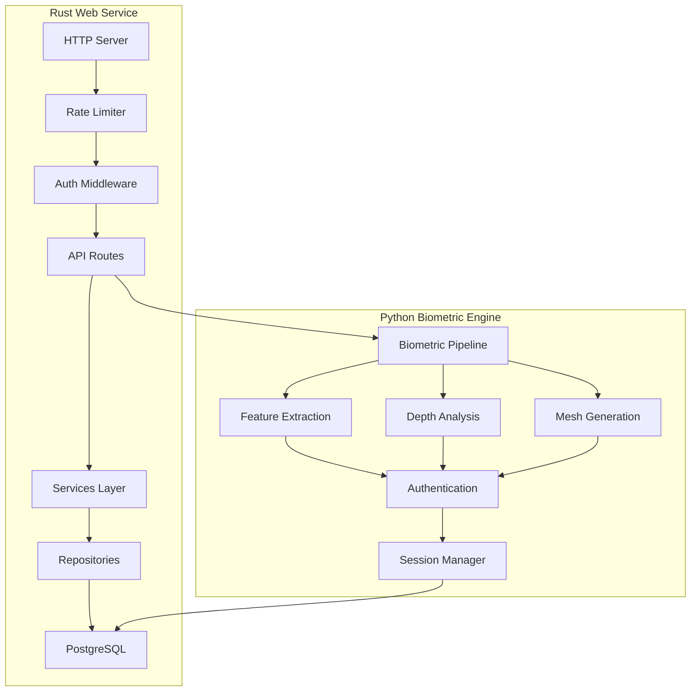
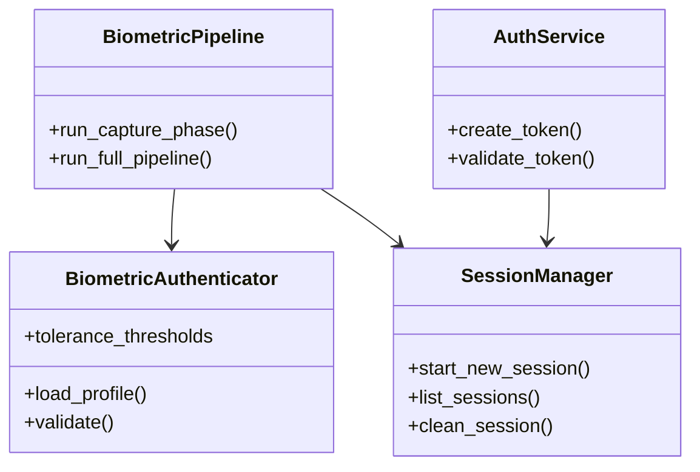

# Secure Biometric Analysis System

A robust biometric authentication and analysis system combining a high-performance Rust web service with advanced Python-based biometric processing capabilities.

## Overview

This project implements a secure biometric authentication system with real-time facial analysis capabilities. It features a Rust-based web service for handling authentication and API requests, coupled with a Python backend for sophisticated biometric processing.

## Architecture



## System Components



## Key Features

- **Secure Authentication**
  - JWT-based authentication
  - Rate limiting (100 requests/minute)
  - Request logging and monitoring
  
- **Biometric Processing**
  - Real-time facial feature extraction
  - 3D depth analysis and mesh generation
  - Configurable tolerance thresholds
  - Anti-spoofing measures
  
- **Session Management**
  - Secure session storage
  - Session cleanup and maintenance
  - Result visualization

## Technical Stack

### Rust Components
- **Web Framework**: Actix-web 4.0
- **Database**: PostgreSQL with SQLx
- **Authentication**: JWT (jsonwebtoken)
- **API Documentation**: Utoipa with Swagger UI
- **Monitoring**: Prometheus

### Python Components
- **Computer Vision**: MediaPipe
- **3D Processing**: Open3D
- **Data Processing**: NumPy, Pandas
- **Visualization**: Matplotlib, Plotly

## Project Structure

```
secure-biometric/
├── src/
│   ├── api/              # API routes and handlers
│   ├── middleware/       # Auth, logging, rate limiting
│   ├── models/          # Database models
│   ├── repositories/    # Database access layer
│   ├── services/        # Business logic
│   └── biometric/       # Python biometric processing
│       ├── auth/        # Biometric authentication
│       ├── pipeline/    # Processing pipeline
│       ├── utils/       # Utilities
│       └── visualization/ # Result visualization
├── migrations/          # Database migrations
├── tests/              # Integration and unit tests
├── Cargo.toml          # Rust dependencies
└── requirements.txt    # Python dependencies
```

## Installation

1. Clone the repository:
```bash
git clone https://github.com/yourusername/secure-biometric.git
cd secure-biometric
```

2. Install Rust dependencies:
```bash
cargo build
```

3. Install Python dependencies:
```bash
pip install -r requirements.txt
```

4. Set up environment variables:
```bash
cp .env.example .env
# Edit .env with your configuration
```

5. Run database migrations:
```bash
cargo run --bin secure-biometric -- migrate
```

## Development

1. Start the Rust web service:
```bash
cargo run
```

2. Run tests:
```bash
cargo test
```

## Configuration

The system uses environment variables for configuration:
- `DATABASE_URL`: PostgreSQL connection string
- `JWT_SECRET`: Secret key for JWT token generation
- `RUST_LOG`: Logging level (e.g., "debug", "info")

See `.env.example` for all available options.

## License

This project is licensed under the MIT License - see the LICENSE file for details.

## Contributing

Contributions are welcome! Please read our contributing guidelines and submit pull requests for any enhancements.
