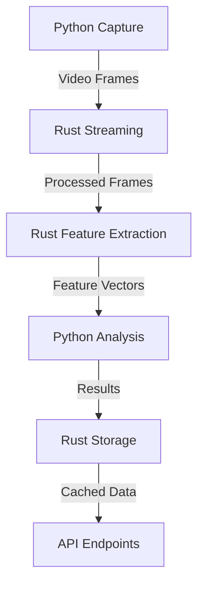

# Secure Biometric System Architecture

## System Overview

The Secure Biometric System combines Python's rich ecosystem for biometric processing with Rust's performance and safety guarantees. The system is designed to be secure, scalable, and efficient.

## Component Architecture

### Rust Backend Components

#### 1. Core Services
- **BiometricDataService**
  - Real-time frame processing
  - Feature vector management
  - Data streaming
  - Caching layer

- **SecurityService**
  - Encryption/decryption
  - Access control
  - Audit logging
  - Compliance management

- **ProcessingService**
  - Parallel computation
  - GPU acceleration
  - Batch processing
  - Load balancing

#### 2. API Layer
- **REST Endpoints**
  - Session management
  - Configuration
  - Results retrieval
  - System health

- **WebSocket Handlers**
  - Real-time video streaming
  - Live processing results
  - Status updates

#### 3. Storage Layer
- **DataStore**
  - Feature vectors
  - Processing results
  - Session data
  - Audit logs

### Python Components (Existing)
- Video capture
- Landmark detection
- Feature analysis
- Mesh generation
- Visualization

## Integration Points

### 1. Data Flow


### 2. Communication Protocols
- **REST API**: Configuration, results, management
- **WebSocket**: Real-time data, status updates
- **Shared Memory**: High-performance data exchange
- **Message Queue**: Async processing tasks

## Security Measures

### 1. Data Protection
- End-to-end encryption
- Secure storage
- Access control
- Audit trails

### 2. Compliance
- GDPR compliance
- Biometric data regulations
- Data retention policies
- Privacy controls

## Performance Optimizations

### 1. Processing
- Multi-threading
- GPU acceleration
- SIMD operations
- Zero-copy data handling

### 2. Storage
- Caching strategies
- Efficient serialization
- Compression
- Index optimization

## Monitoring & Analytics

### 1. System Metrics
- Processing latency
- Resource usage
- Error rates
- System health

### 2. Business Analytics
- Usage patterns
- Success rates
- Performance trends
- Capacity planning

## Development Workflow

### 1. Code Organization
```
rust-process/
├── src/
│   ├── api/           # API endpoints
│   ├── core/          # Core processing
│   ├── security/      # Security services
│   ├── storage/       # Data management
│   └── processing/    # Computation engine
```

### 2. Quality Assurance
- Unit testing
- Integration testing
- Performance benchmarking
- Security auditing

---
Note: This architecture is designed to be modular and scalable, allowing for future enhancements and optimizations.
