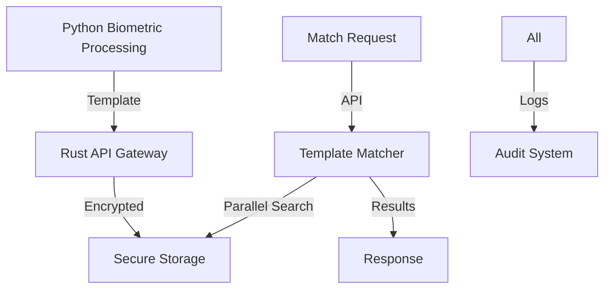

# Rust Backend Design: Secure Biometric Storage & Matching System

## Core Objective
Create a high-performance, secure storage and matching system for biometric templates that complements our Python-based biometric processing system.

## System Overview

### Component Separation

#### Python System (Existing)
- Video capture and processing
- Face landmark detection
- Feature analysis and extraction
- Depth mapping
- 3D mesh generation
- Visualization tools

#### Rust System (New Focus)
1. Secure Template Storage
2. High-Performance Template Matching
3. Security & Compliance Management
4. API Services

## Design Validation

### 1. Technical Feasibility Analysis

#### Secure Storage System
**Question**: Can we ensure secure, high-performance template storage?
**Validation**:
- `ring` for cryptographic operations
- `sled` for embedded database
- `bincode` for efficient serialization
- `zstd` for compression

**Implementation Approach**:
```rust
pub struct SecureVault {
    encryption_engine: EncryptionEngine,
    template_store: TemplateStore,
    audit_logger: Arc<AuditLogger>,
    cache_manager: Arc<CacheManager>
}
```

#### Template Matching Engine
**Question**: Can we achieve fast, parallel template matching?
**Validation**:
- `rayon` for parallel operations
- SIMD operations via `packed_simd`
- Custom distance metrics
- Optimized search algorithms

**Implementation Approach**:
```rust
pub struct TemplateMatcher {
    matcher_pool: ThreadPool,
    similarity_engine: SimilarityEngine,
    cache: Arc<TemplateCache>,
    metrics_collector: MetricsCollector
}
```

### 2. Security Implementation

#### Data Protection
**Question**: How do we ensure template security?
**Validation**:
- AES-256 encryption
- Secure key management
- Template isolation
- Access control

**Implementation Approach**:
```rust
pub struct SecurityManager {
    key_manager: KeyManager,
    access_control: AccessControl,
    audit_system: AuditSystem,
    compliance_checker: ComplianceChecker
}
```

### 3. Integration Architecture

#### API Design
```rust
pub mod api {
    #[derive(Serialize, Deserialize)]
    pub struct Template {
        id: Uuid,
        data: Vec<u8>,
        metadata: TemplateMetadata,
        created_at: DateTime<Utc>
    }

    pub trait TemplateStorage {
        async fn store(&self, template: Template) -> Result<Uuid>;
        async fn retrieve(&self, id: Uuid) -> Result<Template>;
        async fn find_matches(&self, template: Template, threshold: f32) -> Result<Vec<Match>>;
    }
}
```

#### Data Flow


## Implementation Priorities

### Phase 1: Core Storage
1. Secure Template Vault
   ```rust
   pub mod storage {
       pub struct TemplateVault {
           store: EncryptedStore,
           index: SearchIndex,
           cache: TemplateCache
       }
   }
   ```

2. Template Management
   ```rust
   pub mod templates {
       pub struct TemplateManager {
           validator: TemplateValidator,
           transformer: TemplateTransformer,
           versioning: VersionControl
       }
   }
   ```

### Phase 2: Matching Engine
1. Parallel Matcher
   ```rust
   pub mod matching {
       pub struct ParallelMatcher {
           thread_pool: ThreadPool,
           distance_calculator: DistanceCalculator,
           result_aggregator: ResultAggregator
       }
   }
   ```

2. Optimization Layer
   ```rust
   pub mod optimization {
       pub struct MatchOptimizer {
           cache_manager: CacheManager,
           index_optimizer: IndexOptimizer,
           search_planner: SearchPlanner
       }
   }
   ```

### Phase 3: Security & Compliance
1. Security Services
   ```rust
   pub mod security {
       pub struct SecurityService {
           encryption: EncryptionService,
           access_control: AccessControl,
           key_management: KeyManager
       }
   }
   ```

2. Compliance Engine
   ```rust
   pub mod compliance {
       pub struct ComplianceEngine {
           audit_logger: AuditLogger,
           policy_enforcer: PolicyEnforcer,
           report_generator: ReportGenerator
       }
   }
   ```

## Performance Targets

1. Storage Operations
   - Template storage: < 5ms
   - Template retrieval: < 2ms
   - Batch operations: < 50ms for 1000 templates

2. Matching Operations
   - 1:1 match: < 1ms
   - 1:N match: < 100ms for 1M templates
   - Parallel matching: Scale linearly with cores

## Security Requirements

1. Template Protection
   - Encryption at rest and in transit
   - Secure template format
   - Access control
   - Key rotation

2. Compliance Features
   - GDPR compliance
   - CCPA compliance
   - Audit logging
   - Data lifecycle management

## Development Guidelines

1. Code Organization
```
rust-process/
├── src/
│   ├── storage/        # Template storage
│   ├── matching/       # Template matching
│   ├── security/       # Security services
│   ├── api/           # External interface
│   └── common/        # Shared utilities
```

2. Quality Standards
   - Full test coverage
   - Security audits
   - Performance benchmarks
   - Documentation

## Validation Checklist

- [ ] Storage performance verified
- [ ] Matching accuracy tested
- [ ] Security measures audited
- [ ] Compliance verified
- [ ] API stability confirmed
- [ ] Integration tested

---
Note: This design focuses on secure template storage and matching, complementing the Python biometric processing system.
