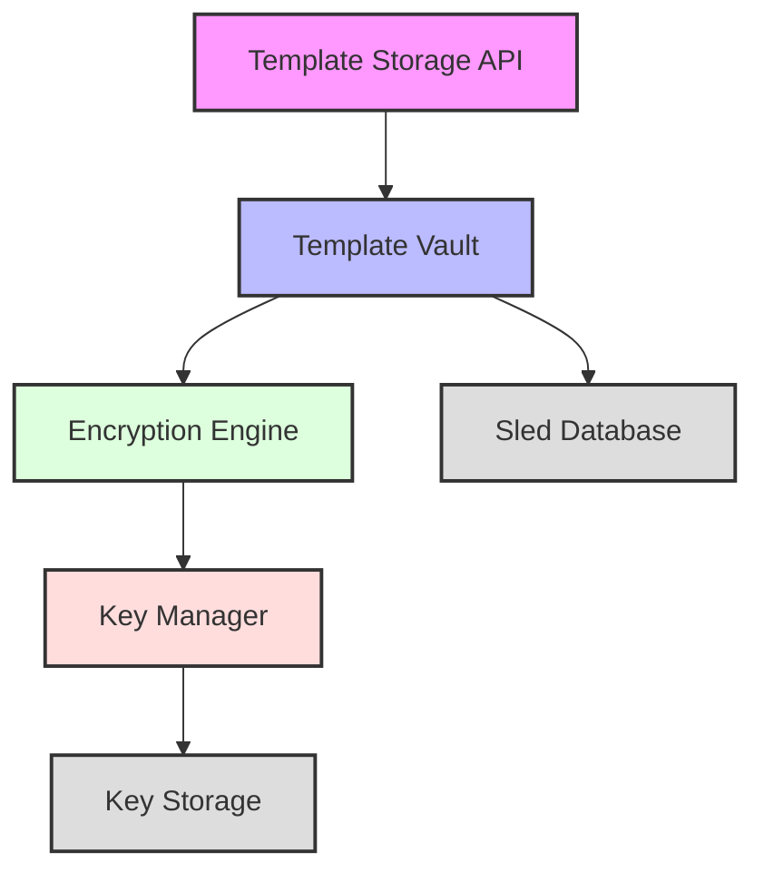
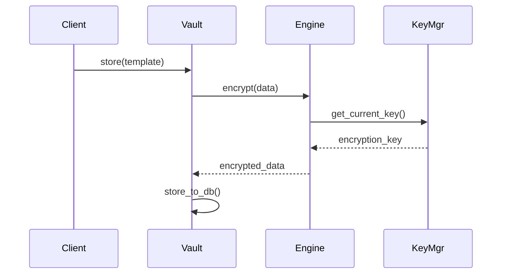

# Rust Backend Technical Design

## Overview

The Rust backend is a high-performance, secure storage system for biometric templates. It provides encrypted storage, template management, and secure key rotation capabilities while maintaining strict security and performance requirements.

## System Architecture

### Core Components



### Module Structure

```
rust-process/
├── src/
│   ├── security/
│   │   ├── encryption.rs    # Encryption engine implementation
│   │   ├── key_manager.rs   # Key management and rotation
│   │   ├── error.rs         # Security-related error types
│   │   └── mod.rs          # Module exports
│   ├── storage/
│   │   ├── vault.rs        # Template vault implementation
│   │   ├── error.rs        # Storage-related error types
│   │   └── mod.rs         # Module exports
│   ├── templates/
│   │   ├── template.rs     # Template data structures
│   │   ├── error.rs        # Template-related error types
│   │   └── mod.rs         # Module exports
│   ├── logging/           # Custom logging implementation
│   ├── lib.rs            # Library interface
│   └── main.rs           # Binary entry point
└── tests/
    ├── functional/       # Core functionality tests
    ├── security/         # Security-focused tests
    ├── performance/      # Performance benchmarks
    └── integration/      # API integration tests
```

## Component Details

### 1. Template Vault

The TemplateVault is the primary interface for template storage and management:

```rust
pub struct TemplateVault {
    db: Arc<RwLock<Db>>,
    encryption: Arc<EncryptionEngine>,
}
```

Key Features:
- Atomic operations using sled's batch system
- Transparent encryption/decryption
- Concurrent access support
- Automatic database maintenance

### 2. Encryption Engine

Implements ChaCha20-Poly1305 encryption for template data:



Key Features:
- ChaCha20-Poly1305 encryption
- Secure nonce generation
- Key rotation support
- Integrity verification

### 3. Key Management

The KeyManager handles encryption key lifecycle:

```rust
pub struct KeyManager {
    current_key: RwLock<LessSafeKey>,
    old_key: RwLock<Option<LessSafeKey>>,
    rng: SystemRandom,
}
```

Key Features:
- Secure key generation
- Atomic key rotation
- Old key preservation for decryption
- Thread-safe key access

### 4. Storage Layer

Uses sled embedded database with optimized configuration:

```rust
let db_config = sled::Config::new()
    .mode(sled::Mode::HighThroughput)
    .flush_every_ms(Some(1000))
    .cache_capacity(1024 * 1024 * 128)
    .path(path);
```

Key Features:
- High-throughput configuration
- Periodic flushing
- Large cache capacity
- Crash recovery

## Security Measures

### Encryption

1. **Algorithm**: ChaCha20-Poly1305
   - High performance on modern hardware
   - Strong security guarantees
   - AEAD properties for integrity

2. **Key Management**:
   ```mermaid
   stateDiagram-v2
       [*] --> Active
       Active --> Rotating: start_rotation
       Rotating --> Active: finish_rotation
       Active --> [*]
   ```

3. **Nonce Handling**:
   - Unique nonce per encryption
   - 12-byte size (96 bits)
   - Generated using SystemRandom

### Data Protection

1. **Template Storage**:
   - Encrypted at rest
   - Integrity verification on retrieval
   - Secure deletion support

2. **Key Rotation**:
   - Zero-downtime rotation
   - Automatic re-encryption
   - Old key preservation

## Performance Optimizations

### Database Configuration

```rust
// High-performance database settings
mode(sled::Mode::HighThroughput)
flush_every_ms(Some(1000))
cache_capacity(128MB)
```

### Concurrent Operations

1. **Read Operations**:
   - RwLock for shared access
   - Batch retrieval support
   - Cached key access

2. **Write Operations**:
   - Atomic batch updates
   - Async flushing
   - Optimized serialization

### Memory Management

1. **Template Handling**:
   - Efficient serialization
   - Zero-copy where possible
   - Proper cleanup in Drop implementations

2. **Database Management**:
   - Periodic compaction
   - Automatic cleanup
   - Memory-mapped operations

## Testing Infrastructure

### Test Categories

1. **Functional Tests**:
   - Core operations
   - Error handling
   - Edge cases

2. **Security Tests**:
   - Encryption verification
   - Key rotation
   - Integrity checks

3. **Performance Tests**:
   - Load testing
   - Concurrent operations
   - Memory usage

4. **Integration Tests**:
   - API endpoints
   - End-to-end flows
   - Error scenarios

### Metrics Collection

```rust
pub struct TestMetrics {
    test_durations: Arc<RwLock<HashMap<String, Vec<Duration>>>>,
    test_results: Arc<RwLock<HashMap<String, bool>>>,
}
```

## Future Enhancements

1. **Performance**:
   - Batch operation optimization
   - Connection pooling
   - Cache tuning

2. **Security**:
   - Hardware security module support
   - Additional encryption algorithms
   - Enhanced audit logging

3. **Functionality**:
   - Template versioning
   - Backup/restore
   - Replication support

## API Documentation

See the [API Documentation](../api/README.md) for detailed endpoint specifications and usage examples.

## Dependencies

Core dependencies and their purposes:
- `sled`: Embedded database
- `ring`: Cryptographic operations
- `tokio`: Async runtime
- `bincode`: Serialization
- `zstd`: Compression

## Configuration

Environment variables and their effects:
- `RUST_LOG`: Logging level configuration
- `DATABASE_PATH`: Template storage location
- `CACHE_SIZE`: Database cache size
- `FLUSH_INTERVAL`: Write flush interval
