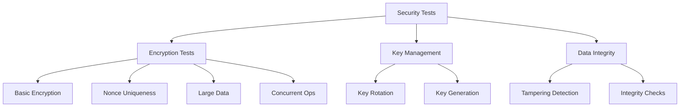
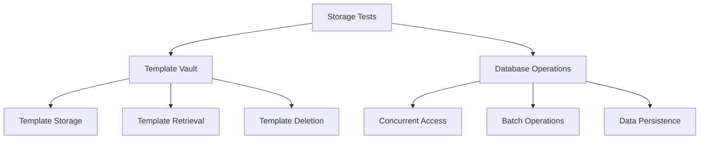
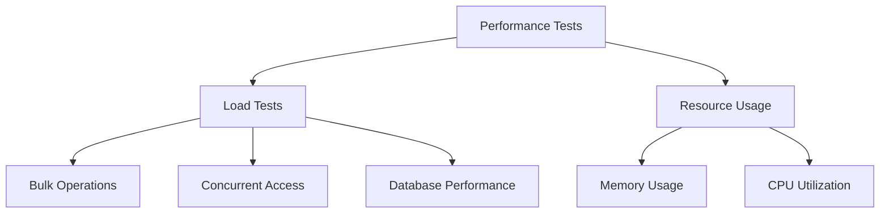
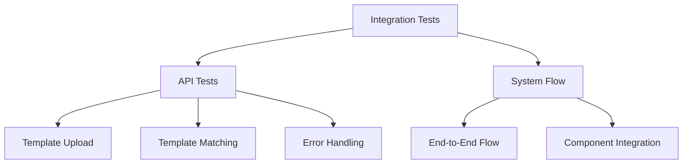

# Rust Backend Testing Documentation

## Overview

This document outlines the testing strategy and implementation for the Rust backend of our Secure Biometric Analysis System. The testing framework is designed to ensure the reliability, security, and performance of our biometric template storage and processing system.

## Test Categories

### 1. Security Tests

Security tests focus on encryption, key management, and data integrity:



#### 1.1 Encryption Tests
- **Basic Encryption** (`test_basic_encryption`):
  - Verifies encryption/decryption of biometric data
  - Ensures ciphertext differs from plaintext
  - Expected: Successful encryption and decryption with data integrity

- **Nonce Uniqueness** (`test_nonce_uniqueness`):
  - Tests uniqueness of nonces in encryption operations
  - Prevents replay attacks
  - Expected: No nonce reuse across multiple encryptions

- **Key Rotation** (`test_key_rotation`):
  - Tests key rotation mechanism
  - Verifies data accessibility after rotation
  - Expected: Successful decryption with both old and new keys during rotation

### 2. Storage Tests

Tests for the template vault and database operations:



#### 2.1 Template Vault Tests
- **Basic Storage** (`test_template_storage_basic`):
  - Tests CRUD operations on templates
  - Verifies data persistence
  - Expected: Successful storage and retrieval with data integrity

- **Vault Encryption** (`test_template_vault_encryption`):
  - Tests encryption of stored templates
  - Verifies encrypted storage on disk
  - Expected: Data stored in encrypted form, retrievable with correct keys

### 3. Performance Tests

Performance testing focuses on system behavior under load:



#### 3.1 Load Tests
- **Bulk Retrieval** (`test_bulk_retrieval`):
  - Tests retrieval of multiple templates
  - Measures throughput and latency
  - Expected: < 500μs per template retrieval

- **Database Performance** (`test_database_performance`):
  - Tests write operations under load
  - Measures operations per second
  - Expected: > 3000 ops/sec

- **Concurrent Storage** (`test_concurrent_storage`):
  - Tests concurrent template operations
  - Verifies data consistency under load
  - Expected: No data corruption or race conditions

### 4. Integration Tests

Integration tests verify system component interactions:



## Test Implementation Details

### Test Structure
- Tests are organized in the `tests/` directory
- Each test category has its own module
- Common test utilities in `tests/common/`

### Test Timeouts
- All async tests include timeouts (default: 10 seconds)
- Prevents test hangs and identifies performance issues

### Performance Metrics
Current performance baselines:
- Template Retrieval: ~215μs per template
- Database Writes: ~3,500 ops/sec
- Batch Storage: ~300μs per template

## Running Tests

To run the test suite:
```bash
cargo test -- --nocapture    # Run with output
cargo test -- --test mod     # Run specific test module
```

### Test Environment
- Tests use temporary directories for storage
- Database configured for high throughput
- Logging configured at INFO level
- Sled database logs filtered to reduce noise

## Continuous Integration

Tests are run automatically on:
- Every pull request
- Main branch commits
- Release tags

## Future Improvements

1. **Additional Test Coverage**
   - Edge case testing for key rotation
   - Network failure scenarios
   - More comprehensive error handling tests

2. **Performance Testing**
   - Long-running stability tests
   - Resource leak detection
   - System limits testing

3. **Security Testing**
   - Penetration testing scenarios
   - Cryptographic algorithm verification
   - Key management stress testing