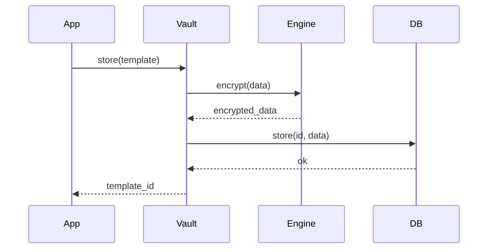
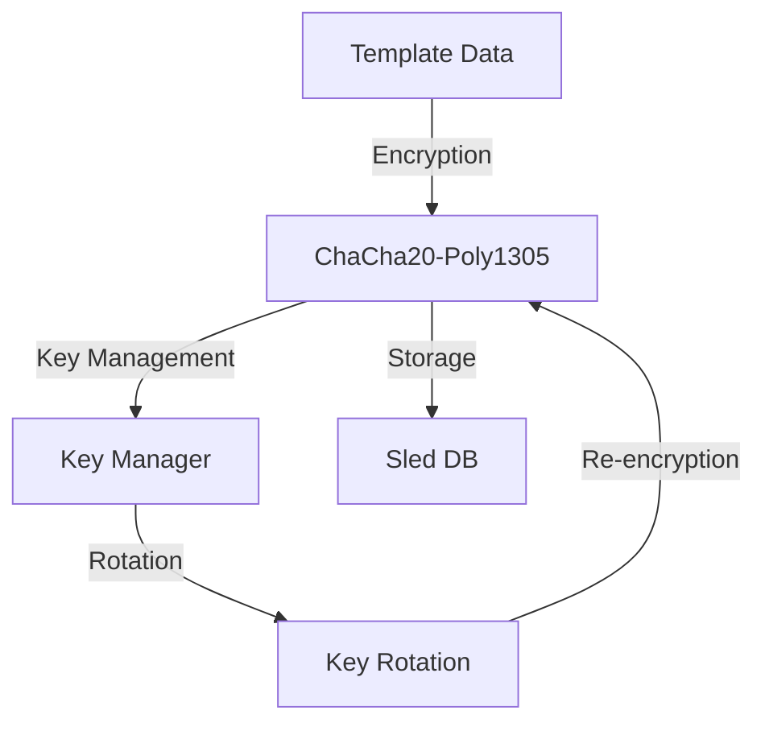

# Secure Biometric Template Storage

A high-performance, secure storage system for biometric templates built in Rust. Features encrypted storage, template management, and secure key rotation capabilities.

## Features

- 🔒 **Secure Storage**: ChaCha20-Poly1305 encryption for all templates
- 🚀 **High Performance**: Optimized for concurrent operations
- 🔄 **Key Rotation**: Zero-downtime key rotation with automatic re-encryption
- 💾 **Efficient Storage**: Using sled embedded database with compression
- 🧪 **Comprehensive Testing**: Security, performance, and integration tests

## Quick Start

### Prerequisites

- Rust 1.70 or higher
- Cargo
- System dependencies for cryptographic operations

### Installation

```bash
# Clone the repository
git clone https://github.com/JtPerez-Acle/secure-biometric
cd secure-biometric/rust-process

# Build the project
cargo build --release
```

### Basic Usage

```rust
use secure_biometric::{
    storage::TemplateVault,
    templates::{Template, TemplateMetadata, TemplateType},
};

#[tokio::main]
async fn main() -> Result<(), Box<dyn std::error::Error>> {
    // Initialize the vault
    let vault = TemplateVault::new("templates.db").await?;

    // Create a template
    let template = Template::new(
        vec![1, 2, 3, 4],
        TemplateMetadata {
            version: "1.0".to_string(),
            template_type: TemplateType::Face,
            quality_score: 0.95,
            extra: serde_json::json!({}),
        },
    );

    // Store the template
    let id = vault.store(template).await?;

    // Retrieve the template
    let retrieved = vault.get(id).await?;
    
    Ok(())
}
```

## Architecture

### Component Flow



### Security Model



## Configuration

### Environment Variables

```bash
# Logging
export RUST_LOG=info  # Set log level (debug, info, warn, error)

# Database
export DATABASE_PATH=/path/to/db  # Template storage location
export CACHE_SIZE=128000000       # Cache size in bytes (default: 128MB)
export FLUSH_INTERVAL=1000        # Write flush interval in ms
```

### Database Settings

The storage system is optimized for high throughput:

```rust
// Default configuration
sled::Config::new()
    .mode(sled::Mode::HighThroughput)
    .flush_every_ms(Some(1000))
    .cache_capacity(1024 * 1024 * 128)
```

## Development

### Running Tests

```bash
# Run all tests
cargo test

# Run specific test categories
cargo test --test security
cargo test --test performance
cargo test --test functional
cargo test --test integration

# Run with logging
RUST_LOG=debug cargo test
```

### Test Categories

1. **Security Tests**: Encryption, key rotation, integrity
2. **Performance Tests**: Load testing, concurrent operations
3. **Functional Tests**: Core operations, error handling
4. **Integration Tests**: API endpoints, end-to-end flows

## Performance

### Optimizations

- Concurrent access using RwLock
- Batch operations for atomic updates
- Efficient serialization with bincode
- Compression with zstd
- Memory-mapped operations

### Benchmarks

```bash
# Run all benchmarks
cargo bench

# Run specific benchmark
cargo bench --bench storage_benchmarks
```

## Security Features

### Encryption

- ChaCha20-Poly1305 for template encryption
- Secure nonce generation per encryption
- Integrity verification on decryption
- Zero-downtime key rotation

### Data Protection

- Templates encrypted at rest
- Secure deletion support
- Automatic key rotation
- Thread-safe key management

## API Documentation

For detailed API documentation, run:

```bash
cargo doc --no-deps --open
```

## Dependencies

Core dependencies:
- `sled`: Embedded database
- `ring`: Cryptographic operations
- `tokio`: Async runtime
- `bincode`: Serialization
- `zstd`: Compression

## Contributing

1. Fork the repository
2. Create a feature branch
3. Commit your changes
4. Push to the branch
5. Create a Pull Request

## License

This project is licensed under the MIT License - see the [LICENSE](LICENSE) file for details.

## Acknowledgments

- [ring](https://github.com/briansmith/ring) for cryptographic operations
- [sled](https://github.com/spacejam/sled) for the embedded database
- The Rust community for excellent tools and documentation

---

For more detailed information about the system architecture and design decisions, see [RUST_BACKEND_DESIGN.md](../docs/RUST_BACKEND_DESIGN.md).
