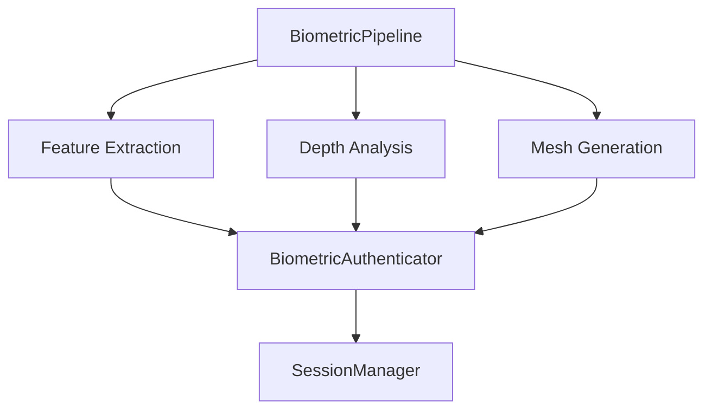

# Secure Biometric - Python Engine

This directory contains the Python implementation of the biometric processing engine.

## Overview

The Python engine provides:
- Real-time facial feature extraction
- 3D depth analysis and mesh generation
- Biometric authentication
- Session management
- Result visualization

## Project Structure

```
src/
├── biometric/
│   ├── analysis/           # Core analysis components
│   │   ├── facial_features/  # Feature extraction
│   │   ├── depth/           # Depth analysis
│   │   └── mesh/            # 3D mesh processing
│   ├── auth/               # Biometric authentication
│   ├── capture/            # Data capture
│   ├── utils/              # Utilities
│   └── visualization/      # Result visualization
└── main.py                # Application entry point
```

## Components

### 1. Biometric Pipeline


### 2. Feature Analysis
- Facial landmark detection
- Expression analysis
- Geometric measurements
- Anti-spoofing checks

### 3. Depth Processing
- 3D point cloud generation
- Depth map analysis
- Surface reconstruction
- Mesh optimization

### 4. Visualization
- Real-time feature display
- 3D mesh rendering
- Depth map visualization
- Analysis results plotting

## Configuration

The engine uses several configuration classes:
- `AnalysisConfig`: Feature analysis settings
- `CaptureConfig`: Video capture parameters
- `VisualizationConfig`: Display options
- `MeshVisualizationConfig`: 3D rendering settings

## Development

1. Install dependencies:
```bash
pip install -r requirements.txt
```

2. Run the application:
```bash
python src/main.py
```

## Integration

The Python engine integrates with the Rust service through:
1. Shared session management
2. Common database schema
3. Standardized authentication protocols
4. Coordinated configuration

## Testing

Run tests with:
```bash
python -m pytest tests/
```
